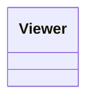

# IA_BoomFest

## IA - Projeto 1

[Project's Git link](https://github.com/Juhhxx/Projecto1_IA.git)

## Authorship

### By Júlia Costa a22304403, Mariana Martins a22302203

## Tasks

* Júlia Costa
* Mariana Martins

---

## Introduction

• Pequena descrição sobre o problema e a forma como o resolveram. Deve oferecer ao leitor informação suficiente para entender e contextualizar o projeto,
bem como quais foram os objetivos e resultados alcançados.

This project aims to simulate the behavior of crowds at a large-scale music festival of which the setting includes multiple stages, food courts and green spaces, where agents move around independently according to their needs (watching shows, resting or eating). This includes their reactions to dangerous events that incite panic like explosions and fires, where the agents must try to escape through the exits of the location.

To achieve an efficient simulation with support for a high number of agents simultaneously, we chose to use **DotRecast**, a library that allows the generation of navigation meshes (navmeshes) and path calculation based on the A* algorithm, and should optimize pathfinding without relying on too detailed physics. We are also implementing a **finite state machine (FSM)** to control each agent's high-level decisions with teh same intent, as the required states, wander/idle, watching concert, hungry, eating, tired, resting and panicked are few, and therefore a good number for FSM implementation.

### Crowd Panic Research

• Deve também ser apresentada nesta secção a pesquisa efetuada sobre simulação baseada em agentes aplicada ao pânico em multidões.

https://www.sciencedirect.com/science/article/pii/S2352146514001355

https://www.researchgate.net/publication/226065087_Pedestrian_Crowd_and_Evacuation_Dynamics

---

## Methodology

• Explicação de como a simulação foi implementada, 2D/2.5D ou 3D, tipo de
movimento dos agentes (cinemático ou dinâmico), com descrição de todas
as técnicas de IA usadas (incluindo figuras, por exemplo ilustrando as árvores e/ou FSMs desenvolvidas), valores parametrizáveis (e.g., número de
agentes, velocidades, etc), descrição da implementação (incluindo diagramas
UML simples ou fluxogramas de algum algoritmo mais complexo que tenham
desenvolvido).
• Esta secção deve ter detalhe suficiente para que outra pessoa consiga replicar
o comportamento da vossa simulação sem olhar para o respetivo código

### Architecture

#### Organizations and Algorithms

##### `Controller`

* Loads terrain data into `Tile` objects and places them in dictionaries, to then copy and create tiles in the grid from.

### UML Diagram

---

## Results and Discussion

• Apresentação dos resultados, salientando os aspetos mais interessantes que
observaram na simulação, em particular se observaram comportamento emergente, isto é, comportamento que não foi explicitamente programado nos agentes.
• Caso tenham experimentado diferentes parâmetros (nº de saídas, nº de agentes, tempos de espera entre zonas, velocidades, taxa de propagação dos incêndios, taxa de propagação do pânico, etc), e/ou quantidade e/ou local das
explosões, podem apresentar quadros, tabelas e/ou gráficos com informação
que considerem importante.
• Na parte da discussão, devem fazer uma interpretação dos resultados que
observaram, realçando quaisquer correlações que tenham encontrado entre
estes e as parametrizações que definiram, bem como resultados inesperados,
propondo hipóteses explicativas.

---

## Conclusion

Nesta secção devem relacionar o que foi apresentado na introdução, nomeadamente o problema que se propuseram a resolver, com os resultados que obtiveram, e como o vosso projeto e a vossa abordagem se relaciona no panorama
geral da pesquisa que efetuaram sobre simulação de pânico em multidões.
• Uma pessoa que leia a introdução e conclusão do vosso relatório deve ficar
com uma boa ideia daquilo que fizeram e descobriram, embora sem saber os
detalhes.

---

## Acknowledgements

• Nesta secção devem agradecer às pessoas externas ao grupo que vos ajudaram
no projeto, caso tenha sido esse o caso.

---

## References

### Open Code

* [Stack Overflow, How to draw tables](https://stackoverflow.com/questions/856845/how-to-best-way-to-draw-table-in-console-app-c)
* [Adding Objects To ScrollView through Script](https://gamedev.stackexchange.com/questions/175483/unity-adding-objects-through-script-to-scrollview-setparent-objects-overlap)
* [Adding a File With an Extension](https://stackoverflow.com/questions/3152157/find-a-file-with-a-certain-extension-in-folder)
* [Iterate Through a 2 Dimensional Array in C#](https://stackoverflow.com/questions/8184306/iterate-through-2-dimensional-array-c-sharp)
* [Markdown inheritdoc](https://stackoverflow.com/questions/74600218/any-benefit-to-using-inheritdoc)

### Libraries

* [Markdown docs](https://paperhive.org/help/markdown)
* [Mermaid docs](https://mermaid.js.org/syntax/flowchart.html)
* [Markdown cheat sheet](https://www.markdownguide.org/cheat-sheet/)
* [Decorator Pattern Wikipedia](https://en.wikipedia.org/wiki/Decorator_pattern)
* [MVC Design Pattern](https://www.geeksforgeeks.org/mvc-design-pattern/)
* [Unity Scripting API](https://docs.unity3d.com)
* [Refactoring - Composite Design Pattern](https://refactoring.guru/design-patterns/composite)
* [Refactoring - Strategy Design Pattern](https://refactoring.guru/design-patterns/strategy)
* [Von Neumann Neighborhood - Wikipedia](https://en.wikipedia.org/wiki/Von_Neumann_neighborhood)
* [Moore Neighborhood - Wikipedia](https://en.wikipedia.org/wiki/Moore_neighborhood)
* [Hotkeys & Strategy - Supreme Commander Beginner's Guide #3](https://www.youtube.com/watch?v=Ao_Zh7LQZ6k&t=267s)
* [Microsoft C# Docs](https://learn.microsoft.com/en-us/dotnet/csharp/)