# IA BoomFest

## IA - Projeto 1

[Project's Git link](https://github.com/Juhhxx/Projecto1_IA.git)

## Authorship

### By Júlia Costa a22304403, Mariana Martins a22302203

## Tasks

* Júlia Costa
  * Create Base System for State Machines,
  * Create Unity Integration for State Machine System using Scriptable Objects,
  * Create Script for Managing Agent Stats,
  * Setup State Machine for Agents.

* Mariana Martins
  * Dotrecast to unity implementations and navmesh through DRcHandle.
  * Different pathfinding behaviours (panic/regular) through Filters and Heuristics.
  * Crowd behaviour system with object pooling through DRCrowdManager.
  * Ordered Execution through Manager system.
  * Seeded random system.
  * Structures system, food area, green space, stage, exits and their handling.
  * Agent state's update target position logic.
  * Explosion and fire system and their effect on agent states.
  * Sprites

---

## Visual Representations

### State Colors

  1. Normal 🟨 (Yellow  #FFD700)
  2. Hungry 🟫 (Brown #5A4633)
  3. Tired 🟦 (Blue #4BA6FF)
  4. Paralyzed 🟪 (Purple #9E00FF)
  5. Panic 🟧 (Orange #FF6D00)

### Sprites

  1. Agent: 
  2. `Fire`: 

### Explosion Ranges

  1. Death: 🟧 (Orange #FF6D00) Sphere
  2. Paralyze: Second Wire Sphere
  3. Panic: Third Wire Sphere

### Structures

  1. Food Area: 🟧 (Orange #FF6D00) Sphere
  2. Green Space: 🟩 (Green #32CD32) Sphere
  3. `Stage`: 🟥 (Red #FF0000) Sphere
  4. `Exit`: 🟪 (Purple #9E00FF)
  5. Path: ⬜ (Gray #808080)
  6. Less Desirable Path: ⬜⬛ (Dark Gray #404040)
  7. Blockage: ⬛ (Black #000000)

---

## Introduction

This project aims to simulate crowd behaviour at large scale events with different settings like concert `Stage`s, food courts and green spaces. Here agents move around independently according to their needs (watching shows, resting or eating), and react to hazards that incite panic like explosions and `Fires`, where the agents must try to escape through the `Exit`s of the event.

To achieve an efficient simulation with support for a high number of agents simultaneously, we chose to use **DotRecast**, a library that allows the generation of navigation meshes (navmeshes) and path calculation based on the A* algorithm, and should optimize pathfinding without relying on too detailed physics. We also implemented a **finite state machine (FSM)** to control each agent's high-level decisions with the same intent, as the required states, watching concert, eating, resting and panicked are few, and therefore a good number for FSM implementation.

### Crowd Panic Research

According to Helbing et al. (2007), panic is triggered by sudden hazards, like the explosions and `Fire` in this project, and spreads quickly as people replicate the fear driven actions of those around them. In learning this, and according to the project guidelines, panic would not be only spread through the immediate explosion range, but also through through a chain reaction propagated continuously by panicked agents.

#### What things do people do when they panic?

Once panicked, people enter flight, flight or freeze responses, and for this project we would be researching flight, where individuals abandon rational decisions over instinctively escaping the hazard as quickly as possible.

In high-density crowds, panic can quickly become dangerous as individuals lose the ability to move independently. In such situations, the crowd behaves like a fluid, when people begin to push, pressure builds up. Even in calm crowds, this can lead to crowd crushes where fatalities occur due to asphyxiation, most commonly while individuals are simply standing, contrary to popular belief that it occurs by trampling.

##### How to replicate these behaviors?

Panic movement often leads to herding (when the crowd starts following the movements of one another), bottlenecks (when the crowd tries to pass through too narrow places all at once), and chaotic motion (unpredictable movement from conflicting intentions in the crowd).

To reflect this, while the agents reach for their nearest `Exit` they would:

* Have increased speed;
* Not have path preferences (by removing weights);
* Prefer to move away from the hazard;
* Show flocking behaviors when near other panicked agents.

The `Exit`s in crowd situations can influence evacuation scenarios as Wagner & Agrawal (2014) states, and we could also incorporate this by exploring different the numbers and poisonings of `Exit`s in the festival, which we can use to study bottlenecks crowd behavior.

#### Reproducibility

Fachada et al. (2015) explains agent models with reproducibility, so while not setting rules for panic behavior it promotes good practices for when working in a team and trying to achieve the same results.

For our project this means defining states and values clearly, having a modular state system, thus FSM, and having consistent logic such as update order and pseudo randoms. These definitions should also help us see how crowd behavior arises from all the agents individual choices.

---

## Methodology

To achieve a scalable and efficient simulation we chose a 2.5D approach where agents are represented with 2D sprites, while the environment uses basic 3D geometry that allows us to bake and query a DotRecast navigation mesh.

Because of these objects that have many instances like fire and agent, rendered with sprites they take much less time to render, and since all materials are unlit, we avoid unnecessary graphical overhead from the 3D geometry for the navmesh as well. Agents move through direct velocity control, without forces and the navigation and pathfinding were handled through DotRecast and DetourCrowd libraries, which gave us a lot of control over agent behaviour while keeping costs minimal.

We utilized UniRecast to import DotRecast libraries into Unity, enabling separate usage of its modules. Despite challenges like lack of documentation and incomplete demo projects, the system was successfully integrated into the project after extensive testing.

Throughout the development process we put scalability and optimization first.

### Seeded Random Determinism

The project uses a seeded random system to help with reproducible behaviors. Every significant game object that needs randomness gets its own ``ISeedRandom`` instance (either a `SeedRandom` or ``RcSeedRandom``). Upon creation, which we make sure the order of in project settings execution order, the object registers with the ``RandomManager``, which then generates a unique seed based on the object’s hierarchy path combined with a global base seed.

This means that on each run each object should produce the same sequence of “random” numbers and by isolating random streams per object (instead of one global random) when we can, even if objects initialize in different orders or new objects are added, the randomness remains consistent for each object’s behavior.

The random generators support both:

* **Uniform distribution**: For unpredictable outcomes.
* **Triangular distribution**: Biases toward middle values when selecting structure spots, simulating more natural congregation patterns while still introducing variation.

### Agent FSMs

For controlling the Agents behaviours, as referenced before, we chose to use a Finite State Machine System. We used the [examples available on moodle](https://moodle.ensinolusofona.pt/mod/resource/view.php?id=439813) as a base, and built upon it for creating a system that would allow us to modularly create our State Machines via the Unity Inspector. This system allowed us to effortlessly mess and play with our Agents until we found their behaviour to be adequate.

We wounded up using the following State Machine model for all of our Agents:

### `Fire` and Explosion System

We implemented a `Fire` and Explosion System to simulate sudden hazards and their spread, where `ExplosionManager` class orchestrates random explosion events on the navmesh by periodically selecting a random navmesh tile, triggering an explosion effect, and notifying the crowd manager to induce panic and paralyzation in surrounding agents.

The explosion finds affected polygons (within configurable death/fear/panic radiuses) and ignites `Fires` on those areas based on a set probability parametrized in the inspector and animates a visual explosion effect​.

For performance, active `Fires` are updated in batches, and each `Fire` object tracks its own lifetime and behavior, and it'a navmesh polygon. Once activated, it increments its lifetime every frame and deactivates itself after a set duration, simulating extinguishing, and at each update, a `Fire` has a small chance to spread to one of its neighboring polygons by calling back to the `ExplosionManager`. This is what `Fire` update batching controls, so lifetime is actually also dependant on number of active `Fires`, this works well, almost as if the `Fire` is consuming oxygen and therefore not spreading as much with more `Fire`.

Agents that enter a tile with active `Fire` are immediately removed from the simulation, and the `AgentStatsController` of each agent checks for this condition each frame, and deactivates the agent if it finds its current polygon is on `Fire`​.

Panic in agents also spreads beyond the immediate explosion if the agent is within a set range of a `Fire`.

### Panic/Normal Navigation

Navigation and pathfinding are handled using DotRecast’s navmesh with custom query filters and heuristics set specifically for the desired, normal vs panic behaviors.

#### Normal Navigation

`DtQueryRegularFilter` is the default filter for agents in normal state, it takes in consideration area costs, and computes movement cost as distance multiplied by the area weight​.

Area costs are set manually each run from locations that have been baked had more weighted.

The `DtQueryRegularHeuristic` simply uses the squared Euclidean distance to the goal as an admissible heuristic​

#### Panic Navigation

When agents are panicked, we switch to `DtQueryPanicFilter` which heavily penalizes all danger (`Fire` and explosions).

If the current polygon has `Fire`, it multiplies the regular cost by 10.

The `DtQueryPanicHeuristic` adjusts the heuristic by subtracting the distance from the last known explosion location.

These behaviors cause panicked agents to prioritize safety and speed over usual path preferences as they move faster and choose longer but safer routes that lead away from hazards.

### Architecture

#### `AgentStatsController`

Manages an agent’s movement, state, and stats. It integrates with the crowd manager (`DRCrowdManager`) by adding/removing the agent on activation/deactivation. Each frame it updates the it's transform and rotation from the crowd agent’s position and velocity by smoothing it out and checks for hazards, if the agent’s current polygon has active `Fire`, it immediately deactivates the agent​.

Handles internal stats  and state transitions and randomly initializes a starting state and then runs coroutines to deplete or restore hunger and energy over time. When hunger or energy cross the limits, it updates the agent’s AgentStat, which the FSM uses to change behavior.

#### `Manager`

An abstract MonoBehaviour base class for all manager components in the project that require a controlled initialization and update order. It declares abstract ordered methods so instead of relying on Unity’s non-deterministic script execution order, each manager’s setup is invoked explicitly in a known sequence.

#### `DRcHandle`

The DotRecast Handle is a central navigation manager (inherits Manager) responsible for loading and managing the NavMesh and coordinating other managers’ initialization.

On bake, the DtNavMesh data is stored, and a DtNavMeshQuery is created for pathfinding queries.
When loading the bake, it looks for any defined convex volume areas in the scene and marks the navmesh polys inside those volumes with a different area type for custom behavior.

`DRcHandle` has an array of all Manager instances and is responsible for invoking all manager's Ordered methods.

It also provides static methods for all other scripts to help in the interpretation of its navmesh with dotrecast's system.

#### `DRCrowdManager`

The `DRCrowdManager` is the main agent manager (inherits Manager) that handles crowd simulation on the DotRecast navmesh, connecting physical crowd simulation with agent behaviors like panic reactions for transitions without breaking pathfinding.

On AwakeOrdered, it initializes a DtCrowd system using the baked navmesh and configures the agent parameters for normal, panic and paralyzed behaviors.

On Bake, pre-creates a pool of agent prefabs that are kept inactive until UpdateOrdered, where it activates agents if there are available `Exit` spots and adds them to the simulation. Spawns are limited to one per frame to simulate natural entrance pacing.

Each frame, it also updates the DotRecast crowd simulation and refreshes how many agents occupy each polygon (used by structures to decide if a spot is available).

It handles adding and removing agents to/from the navmesh, setting agent movement targets and snapping positions to the nearest navmesh polygon, and notifying agents when they are caught inside an explosion radius, as well as agents spreading panic by proximity if they detect nearby `Fire` or paralyzed agents.

#### `ExplosionManager`

Manages global hazard events and coordinates with the crowd system​. It pre-bakes a pool of `Fire` objects for each navmesh polygon, and at runtime it randomly triggers explosions with configurable frequency. When an explosion occurs, it finds all polygons within the death radius and may set them on `Fire` based on a probability​. It also notifies the crowd manager (`DRCrowdManager`) to induce panic within the explosion’s death/fear/panic radii. Active `Fires` are updated in batches each frame for efficiency.

##### `Fire`

Represents a `Fire` on a navmesh polygon. On each ordered update, it increments its lifetime and deactivates the GameObject after _duration seconds​. Each frame it has a small chance (set by_`Fire`Propagation) to ignite one of its neighboring polygon tiles via the `ExplosionManager` (spreading the `Fire`).

#### `RandomManager`

A singleton Manager responsible for coordinating all seeded random streams. It holds a list of all `ISeedRandom` instances (e.g. from SeedRandom and `RcSeedRandom`) and assigns each a unique deterministic seed based on a global BaseSeed (default 12345) combined with the GameObject’s hierarchy path. This ensures reproducible random behavior across the project. It exposes a RegisterStream(`ISeedRandom`) method that generates the unique ID and returns a new System.Random instance seeded with BaseSeed ^ ID. All random-generating objects use this to initialize their internal Random source.

##### `ISeedRandom`

Defines a generic interface for seeded random number generators tied to specific GameObjects. It provides methods for obtaining random integers/floats and triangular-distributed values, ensuring each generator has an Owner object and a unique ID for seeding.

##### `SeedRandom`

A general-purpose implementation of `ISeedRandom`. Each instance is associated with a GameObject and registers itself with the `RandomManager` to obtain a unique seed. It provides uniform random ranges (Range(int, int) and Range(float, float)) and triangular-distributed randoms (favoring mid-range values) for more natural variation.

##### `RcSeedRandom`

A specialized random stream that implements both `ISeedRandom` and DotRecast’s IRcRand interface. It is used for randomization within the DotRecast navigation system. Like SeedRandom, it registers with the `RandomManager` for a deterministic seed. It provides methods (Next(), NextDouble(), NextInt32(), etc.) needed by DotRecast, in addition to range and triangular distributions.

#### `Structure<T>`

An abstract generic base class for all interactive areas in the simulation that maintains a static registry of all instances of type T (all `Exit`s, all food areas), and defines common behaviors:

  1. A defining the zone of influence (for detecting when an agent “enters” the area).

  2. An array of points within the structure where agents can go, each stored as a world-space position with its navmesh polygon reference.

  3. An initializer (called through AwakeOrdered) that seeds a local random generator for the structure, finds the navmesh position of a pivot point as the structure’s center, and calls the subclass’s implementation of SetUpPoints() to populate the array of points.

FindNearest(pos) finds the closest structure of that type to a position

EnteredArea(pos) checks if a point is within the structure’s radius

IsGoodSpot(polyRef) checks if a given navmesh polygon is below the set agent capacity for a structure's point.

GetBestSpot(currentPos, structure, out newStruct) picks an optimal spot within a structure. It uses the structure’s seeded random to select one of it's points (with a triangular distribution bias toward middle indices) and checks if that spot is free. It will try a few times to find a free spot, but if none are available, it finds a new structure of the same type nearest to the agent and returns that, redirecting the agent to a less crowded structure. The chosen spot (or a spot in a new structure) is returned as a tuple of navmesh position and reference.

##### `Exit`

A concrete structure representing an `Exit` area that inherits Structure<`Exit`>.

An `Exit` contains one or more specific `Exit` points, and its SetUpPoints() iterates through these transforms to project each onto the navmesh. It uses `DRcHandle`.FindNearest() to get the nearest navmesh polygon for each `Exit` Transform and stores those points in the structures point array.

These methods are only used for agent object pooling:
GetRandomGood`Exit`(randomValue, out pos) is a static helper that uses a random integer to pick a random `Exit` instance from the registered list and then a random point within it.
Any`Exit`Unoccupied() is also static method that scans all `Exit` points across all `Exit` instances to determine if at least one `Exit` spot has capacity, and is used to decide if a new agent can be spawned.

##### `FoodArea`

A concrete structure representing a food area that inherits Structure<`FoodArea`>.

A `FoodArea` contains one or more specific table points, and its SetUpPoints() iterates through these transforms to project each onto the navmesh. It uses `DRcHandle`.FindNearest() to get the nearest navmesh polygon for each `Exit` Transform and stores those points in the structures point array.

##### `GreenSpace`

A concrete structure representing a green area that inherits Structure<`GreenSpace`>.

A `GreenSpace` uses the object’s scaled size and a defined spacing to lay out a grid of candidate points across the area.
For each grid intersection, it calls `DRcHandle`.FindNearest to snap that point to the navmesh, and collects it into points if it's valid.

##### `Stage`

A concrete structure representing a `Stage` area that inherits Structure<`Stage`>.

A `Stage` computes the front center of the `Stage` based on the object’s forward direction and scale, determines the end points of the `Stage` front (edges), and then interpolates a series of points between those edges at a given spacing.
For each interpolated point, it calls `DRcHandle`.FindNearest to snap that point to the navmesh, and collects it into points if it's valid.

##### `StateNavHelper`

A static utility class to assist with agent navigation state logic, especially for moving agents into structures. It provides a generic method FindSpot<T> that contains the logic that an agent’s finite state machine would normally use to reach a spot:

  1. If the agent doesn’t yet have a target structure, it finds the nearest one of type T and sets that as the target (directing the agent’s navigation toward the structure’s center).

  2. If the agent is within the structure’s area, it checks if the agent has reached or is targeting a specific spot. If not, it uses GetBestSpot to obtain an optimal spot and then sets the agent’s navigation target to that spot. Though if GetBestSpot suggests a different structure, it updates the agent’s currentStructure and redirects the agent to the new structure’s center.

  3. If the agent has a target spot and is close enough to it, FindSpot returns that the agent has successfully arrived at a spot and the state machine can consider the task complete.
  
If the agent is outside the structure’s radius or structure has not yet been set, it makes sure the agent’s next target is the a structure’s position to guide them inside.

#### `DtQueryFilter`

Base class for pathfinding cost filters​. It holds a reference to the `ExplosionManager` to query active `Fires`. By default, it returns the squared distance between points as cost and only passes polygons that are of ground type​

##### `DtQueryRegularFilter`

Specialized filter for “normal” (non-panicked) agents​. It initializes all area types with increasing costs and computes movement cost as the distance between points multiplied by the area’s weight​. (Future modifications could change these weights to prefer or avoid certain areas.)

##### `DtQueryPanicFilter`

Panic-mode filter for panicked agents​. It overrides GetCost to heavily penalize hazards: if the agent’s current polygon has active `Fire`, it multiplies the cost by 10, it also adds a penalty based on proximity to the most recent explosion center (higher penalty the closer it is)​. This makes paths near `Fires` or the explosion much less attractive for pathfinding.

##### `DtQueryRegularHeuristic`

Regular heuristic returning the squared Euclidean distance from a node to the goal​. Used in normal pathfinding as an admissible A* heuristic.

##### `DtQueryPanicHeuristic`

Panic-mode heuristic that encourages moving away from `Fire`​. It computes a cost by subtracting the squared distance from a known `Fire` position (if any) from the distance to the goal, thus biasing paths that increase distance from `Fires`.

#### `State`

Class that defines a `State` in a State Machine. It contains a `List<T>` of `Transitions` and 3 `delegates` of type `Action` (`EntryActions`, `StateActions` and `ExitActions`) that store all methods to be performed in the beggining, during and at the end of the `State`. There is also the method `void AddTransitions(Transition transition)` that adds a `Transition`to the list Transitions.

#### `Transition`

Class that defines a `Transition` in a State Machine. It contains a reference to a `State`, to store what `State` the `Transition` leads to, and 2 delegates, one of type `Action`, to store methods to performed when the `Transition` is triggered, and one of type `Func<bool>`, to store the a method that check the condition for the `Transition` to be triggered. There is also the method `bool IsTriggered()` that checks if the `Transition`has been triggered and returns true or false accordingly.

#### `StateMachine`

Class that defines and runs a `State Machine` with various `States`and `Transitions`. It contains a reference to a `State`, to store what `State` the `State Machine` starts running. There are also 2 methods `void ResetStateMachine()`, that resets the `State Machine`to it's default `State`, and `Action Update()`, that manages the `State Machine` by analyzing the current `States` `Transitions` to see if they've been triggered, and changing `States`if necessary, this method returns an `Action` type delegate with all methods to be performed in each frame.

#### `StateAbstract`

Abstract class, that inherits from `ScriptableObject`, it defines various abstract methods that when overwritten, will work as the Entry, State and Exit `Actions` of a `State`. This class let's us create various `States` in Unity that can be used to modularly build `State Machines`.

#### `TransitionAbstract`

Abstract class, that inherits from `ScriptableObject`, it defines various abstract methods that when overwritten, will work as the Actions and Conditions for a `Transition`, it also contais a reference to a `StateAbstract` that can be defined via the Unity Inspector.

#### `StateTransition`

Struct that that defines a `State`and it's `Transitions` (in a `List<t>`). It is used to help build `State`classes without hardcoding the `Transitions`, as we are able to read the list containing each `States` `Transitions`and add them through code.

#### `StateMachineCreator`

Class, that inherits from `ScriptableObject`, it contains a `List<t>` of `StateTransitions` that form the `State Machine`. This class allows us to build `State Machines` inside the Unity Inspector, only by draging, creating and configuring `StateAbstract` and `TrasitionAbstract` `ScriptableObjects`.

#### `StateMachineRunner`

Class, that inherits from `Monobhehaviour`, it contains a reference to a `StateMachineCreator`. It creates a copy of the referenced `State Machine` and runs it via the `void Update()` method.

#### UML Diagram

```mermaid
classDiagram
  class MonoBehaviour
  class ScriptableObject

  class TabletopCamera

  class Manager
  class RandomManager
  <<singleton>> RandomManager
  class DRcHandle
  class DRCrowdManager

  class UniRcNavMeshSurface
  class UniRcConvexVolumeTool
  class DtNavMesh
  class DtNavMeshQuery
  class IDtQueryFilter

  class DtQueryFilter
  class DtQueryPanicFilter
  class DtQueryPanicHeuristic
  class DtQueryRegularFilter
  class DtQueryRegularHeuristic

  class AgentStatsController
  class StateMachineRunner
  class StateMachine
  class StateAbstract
  class TransitionAbstract
  <<abstract>> TransitionAbstract
  class StateTransition
  <<struct>> StateTransition
  class Transition

  class Structure~T~
  class Exit
  class FoodArea
  class GreenSpace
  class Stage
  class StateNavHelper
  struct RcVec3f

  enum AgentStat

  class ISeedRandom
  <<interface>> ISeedRandom
  class  IRcRand
  <<interface>> IRcRand
  class SeedRandom
  class RcSeedRandom

  class ExplosionManager
  class Fire



  MonoBehaviour <|-- Structure~T~
  MonoBehaviour <|-- TabletopCamera
  MonoBehaviour <|-- Manager
  MonoBehaviour <|-- AgentStatsController
  MonoBehaviour <|-- Fire
  MonoBehaviour <|-- StateMachineRunner

  Manager <|-- RandomManager
  Manager <|-- DRcHandle
  Manager <|-- DRCrowdManager
  Manager <|-- ExplosionManager



  Structure~T~ --> RcVec3f
  Structure~T~ --> ISeedRandom
  Structure~T~ --> List~T~

  Stage --|> Structure~Stage~
  Stage --> DRcHandle

  GreenSpace --|> Structure~GreenSpace~
  GreenSpace --> DRcHandle
  
  FoodArea --|> Structure~FoodArea~
  FoodArea --> DRcHandle

  Exit --|> Structure~Exit~
  Exit --> DRcHandle

  StateNavHelper --> AgentStatsController
  StateNavHelper --> Structure~T~
  StateNavHelper --> RcVec3f



  ExplosionManager *-- Fire
  Fire --> ExplosionManager
  ExplosionManager --> DRcHandle
  ExplosionManager --> DRCrowdManager
  ExplosionManager --> Fire
  ExplosionManager --> ISeedRandom


  RandomManager --> ISeedRandom
  RandomManager --> System.Random

  ISeedRandom --> System.Random

  SeedRandom ..|> ISeedRandom
  SeedRandom --> RandomManager

  RcSeedRandom --> RandomManager
  RcSeedRandom ..|> ISeedRandom
  RcSeedRandom ..|> IRcRand



  DRCrowdManager o-- DRcHandle
  DRCrowdManager o-- ExplosionManager
  DRCrowdManager o-- AgentStatsController
  DRCrowdManager o-- ISeedRandom
  DRCrowdManager o-- DtCrowd
  DRCrowdManager o-- DtCrowdAgentParams

  AgentStatsController --> DtCrowdAgent
  DRCrowdManager --> RcVec3f



  DRcHandle o-- Manager
  DRcHandle --> UniRcNavMeshSurface
  DRcHandle --> UniRcConvexVolumeTool
  DRcHandle --> DtNavMesh
  DRcHandle --> DtNavMeshQuery
  DRcHandle --> IDtQueryFilter



  class State
  class Transition
  class StateMachine
  class StateAbstract
  <<abstract>> StateAbstract
  class TransitionAbstract
  <<abstract>> TransitionAbstract
  class StateTransition
  <<struct>> StateTransition
  class StateMachineCreator
  class StateMachineRunner

  State o-- Transition

  Transition --> State

  StateMachine --> State

  StateAbstract --|> ScriptableObject
  StateAbstract --> State
  StateAbstract --> GameObject

  TransitionAbstract --|> ScriptableObject
  TransitionAbstract --> Transition
  TransitionAbstract --> StateAbstract
  TransitionAbstract --> GameObject

  StateMachineCreator --|> ScriptableObject
  StateMachineCreator --> StateMachine
  StateMachineCreator o-- StateTransition
  StateMachineCreator --> GameObject

  StateTransition --> StateAbstract
  StateTransition o-- TransitionAbstract

  class TransitionCheckAgentStat
  class TransitionCheckExplosionRadius
  class TransitionKeyPressed
  class TransitionWaitForSeconds


  TransitionCheckAgentStat ..|> TransitionAbstract
  TransitionCheckAgentStat --> AgentStatsController
  TransitionCheckAgentStat --> AgentStat

  TransitionCheckExplosionRadius ..|> TransitionAbstract
  TransitionCheckExplosionRadius --> AgentStatsController

  TransitionKeyPressed ..|> TransitionAbstract
  TransitionKeyPressed --> KeyCode

  TransitionWaitForSeconds ..|> TransitionAbstract


  class StateDeath
  class StateHungry
  class StatePanic
  class StateParalyzed
  class StateTired
  class StateWatchConcert
  

  StateDeath --|> StateAbstract
  StateDeath --> AgentStatsController

  StateHungry --|> StateAbstract
  StateHungry --> AgentStatsController
  StateHungry --> Structure~FoodArea~
  StateHungry --> StateNavHelper

  StatePanic --|> StateAbstract
  StatePanic --> AgentStatsController
  StatePanic --> Structure~Exit~
  StatePanic --> StateNavHelper

  StateParalyzed --|> StateAbstract
  StateParalyzed --> AgentStatsController

  StateTired --|> StateAbstract
  StateTired --> AgentStatsController
  StateTired --> Structure~GreenSpace~
  StateTired --> StateNavHelper

  StateWatchConcert --|> StateAbstract
  StateWatchConcert --> AgentStatsController
  StateWatchConcert --> Structure~Stage~
  StateWatchConcert --> StateNavHelper


  AgentStatsController --> DRCrowdManager
  AgentStatsController --> StateMachineRunner

  AgentStatsController --> DtCrowdAgent
  AgentStatsController --> AgentStat
  AgentStatsController --> ISeedRandom

```

---

## Results and Discussion

In the early stages of the project, a lot of time was spent experimenting and attempting to understand dotrecast library’s functionality, including developing test scripts that were later removed once a clearer implementation path was established.

This led to wasted time implementing behavior that already existed, but once basic crowd navigation was functioning, the redundancy was worth it, as it was a valuable learning about DotRecast’s architecture, and we were able to confirm the advantages of it.

Some of the advantages we found of dotrecast were:

  1. Runs faster as DotRecast is a C# port of C++ Recast and Detour libraries.
  2. Comes with DetourCrowd, which handles agent local avoidance and herd behavior
  3. Super custom, custom filters, heuristics, and costs.
  4. It allows you to handle movement without relying on Unity’s physics and rigidbody updates per agent.

Although we did not apply this, dynamic navmesh allows updating only the tiles affected by change, so we don't have to rebake entire navmeshes at runtime.

One of the most impactful optimizations to the crowd system was the implementation of update batching for agents and fire objects which allowed the simulation to maintain stable performance even with 2000 agents.

Although it does make the path movement choppy, we started to use the regular update for only visual movement smoothing, even when desynchronized from the real agent positions, as it maintained the appearance of constant activity even when agentes were not actively updating their paths.

Testing of this began with around 500 agents and progressively scaled up, and using the Unity Profiler, we implemented optimization changes such as using unlit materials, SRP rendering, disabling lighting, minimizing camera movement updates, and enabling GPU instancing.
Slowly we started achieving stable simulations of up to 2500 agents. At 1000 agents, the simulation averaged around 50 FPS, while at 2000 agents it dropped to approximately 5 FPS on a Zephyrus G14 laptop.

| Number of Agents | Average FPS (Zephyrus G14) |
|------------------|----------------------------|
| 500              | ~90 FPS                    |
| 1000             | ~50 FPS                    |
| 2000             | ~5 FPS                     |
| 2500             | ~2 FPS                     |

With the finished project, we found while testing interesting results and behaviours, that we noted as we were testing our scene with different values for our parameters, those are the following:

* **Human Social Behavior** -
  Some agents have the tendency to skip over to the next area objective (stages, green spaces, food areas), if the current path they are following is crowded with other agents, even if the next area is much farther away. This emerging behaviour mimics how humans usually go to the line next to them as "is seems faster";

  Some agents have the tendency to start "going with the flow" of the crowd. For example, when an agent is walking in a certain direction, but passes through a group of agents going in a different direction, they tend to start following the group, as if they were part of a flock;

* **Bottlenecks** -
  Agents in a state of panic tend to join together in big groups. These groups cause confusion and chaos among the agents, that bump against each other in their attempt to escape. This causes the groups to become stuck sometimes, and at exits creates big **bottleneck effects**  as all the agents are trying to get through a tight space at the same time;
  
  When too many agents attempted to get to the stage at the same time, they would push forward into walls, resulting in circular motion like in "cattle crush" phenomena, and jittering from the agents under most pressure, describing a situation of a “crowd crush”. These were easily fixed by adjusting agents' separation weights and speeds. More separation weight, more stability.
  
  However, when agents were allowed too much separation weight, they often stopped in their tracks to follow the crowd, even when their objectives were not the same. For that it was necessary to test and achieve balanced weight.

* **Crowd Clumping** -
Randomly choosing points across the entire concert area gave too even results, so we implemented triangular randoms, to favor center change points. This produced much more realistic audience formations but it also increased the likelihood of circular crowd movements, since more agents were moving toward the exact same point at the same time.

* **Explosions and Fire** -
  Fire spread would be extremely sensitive to parameter tuning, even a small change in explosion rate or propagation chances could rapidly escalate into uncontrollable disasters or no fire at all.

  This happened because of all the stacked randoms on top of eachother, particularly update batching, if updating too little fires at a time, some fires could never even get a chance to try to spread. The probability had become degraded from the choices before it and therefore became imprecise.

---

## Conclusion

This project aimed to simulate large-scale crowd behavior during an event, focusing on independent movement, actions driven by needs, and panic reaction to hazards, our approach prioritized scalability, determinism, and emergent behavior, following practices proposed in literature such as Helbing et al. (2007) and Fachada et al. (2015). By integrating DotRecast navigation and a modular finite state machine architecture, we achieved these goals with efficient crowd simulation capable of handling up to 2500 agents.

The use of seeded randomness and triangular distributions reproduced more realistic behaviors, and optimizations were essential to maintain performance under heavy load. The results demonstrate that simple agent logic, combined with efficient navigation and environment design, can successfully recreate complex crowd behaviors observed in real-world panic situations.

While we tested the simulation we noticed that much of the behaviours we researched were being exhibited by the agents, like the *bottleneck effect*, the formation of huge crowds that trample each other, herding and chaotic movement, this reveals that we were able to create what we believe is a somewhat realistic simulation, where we can find a lot of behaviours that replicate real life crowd formations.

All our efforts to ensure a smooth-running simulation, like the 2.5D approach for movement, using unlit graphics and simple geometry, also payed off, as we were able to have many independent agents running at the same time with reasonably good frame rates.

In conclusion, we think we were able to achieve the majority of what we set out to do. Our simulation is able to generate and support up to 1000 agents (and more!) all independent from each other, all moving according to their objectives and using A* pathfinding.

---

## References

### Videos

* [UniRecast Setup Video (YouTube)](https://www.youtube.com/watch?v=lXHL1HFL5wo)
* [Crowd Simulation Lecture (YouTube)](https://www.youtube.com/watch?v=ldOprmqSt7o)
* [Unite 2016 - Overthrowing the MonoBehaviour Tyranny in a Glorious Scriptable Object Revolution (Youtube)](https://www.youtube.com/watch?v=6vmRwLYWNRo)

### Open Code

* [Markdown inheritdoc](https://stackoverflow.com/questions/74600218/any-benefit-to-using-inheritdoc)
* [Pedestrian Crowd Simulation Paper (ScienceDirect)](https://www.sciencedirect.com/science/article/pii/S2352146514001355)
* [Pedestrian Crowd and Evacuation Dynamics (ResearchGate)](https://www.researchgate.net/publication/226065087_Pedestrian_Crowd_and_Evacuation_Dynamics)
* [Crowd Simulation Paper (PeerJ)](https://peerj.com/articles/cs-36.pdf)
* [DotRecast Unity Port Discussion (Unity Forum)](https://discussions.unity.com/t/dotrecast-a-port-of-recast-detour-navigation-mesh-toolset-for-games-unity3d-servers-c/930615)
* [UniRecast GitHub Repository](https://github.com/ikpil/UniRecast)
* [Reflection Probe Atlas Overhead Discussion (Unity Forum)](https://discussions.unity.com/t/update-reflection-probe-atlas-causing-large-overhead-in-empty-scene/1527603/5)
* [Unity Simple FSMs Project (Moodle))](https://moodle.ensinolusofona.pt/mod/resource/view.php?id=439813)
* [Crowds in front of bottlenecks at entrances from the perspective of physics and social psychology](https://royalsocietypublishing.org/doi/10.1098/rsif.2019.0871)

### Libraries

* [Markdown docs](https://paperhive.org/help/markdown)
* [Mermaid docs](https://mermaid.js.org/syntax/flowchart.html)
* [Markdown cheat sheet](https://www.markdownguide.org/cheat-sheet/)
* [Unity Scripting API](https://docs.unity3d.com)
